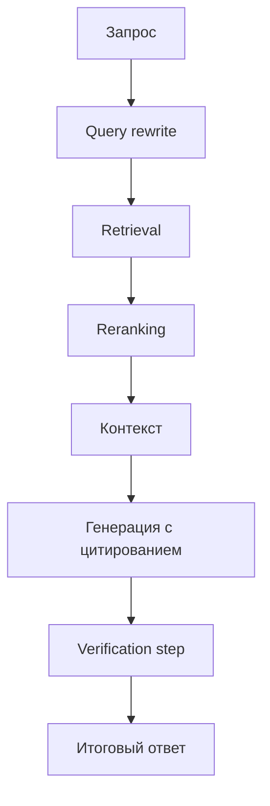

# Verified RAG Agent

## Кратко
Локальный RAG-пайплайн с упором на проверяемость: retrieval, переформулировка запроса, цитирование и verification-step перед финальным ответом.

## Задача
Сделать более проверяемый контур question answering, где ответ не только опирается на найденные фрагменты, но и проходит отдельный шаг верификации.

## Что улучшено
- query rewrite улучшает формулировку запроса к retrieval-слою;
- reranking повышает качество top-k контекста;
- verification-step помогает отфильтровать слабозаземлённые ответы и усилить проверяемость.

## Архитектура


## Метрики и результаты
| Режим | HitRate@K | MRR | groundedness | latency |
|---|---:|---:|---:|---:|
| baseline RAG | TBD | TBD | TBD | TBD |
| + query rewrite | TBD | TBD | TBD | TBD |
| + query rewrite + reranking | TBD | TBD | TBD | TBD |
| + query rewrite + reranking + verification | TBD | TBD | TBD | TBD |

В README отдельно написать, чем verified RAG отличается от обычного RAG: verification-step не заменяет retrieval, а усиливает надёжность финального ответа.

## Структура репозитория
- `src/` — ключевые модули пайплайна;
- `eval/` — код или артефакты оценки;
- `configs/` — конфигурации режимов;
- `docs/`, `examples/`, `tests/` — документация, примеры и проверки.

## Запуск
```bash
python -m venv .venv
source .venv/bin/activate
pip install -r requirements.txt
python -m src.main  # заменить на актуальную точку входа
```

## Ограничения
- локальный режим ограничивает масштаб эксперимента;
- без размеченной эталонной выборки groundedness оценивается ограниченно;
- verification-step чувствителен к качеству промежуточного контекста.

## Направления развития
- добавить отдельный протокол оценки проверяемости;
- расширить набор контрпримеров;
- сделать подробный журнал этапов пайплайна;
- сравнить несколько стратегий verification-step.
